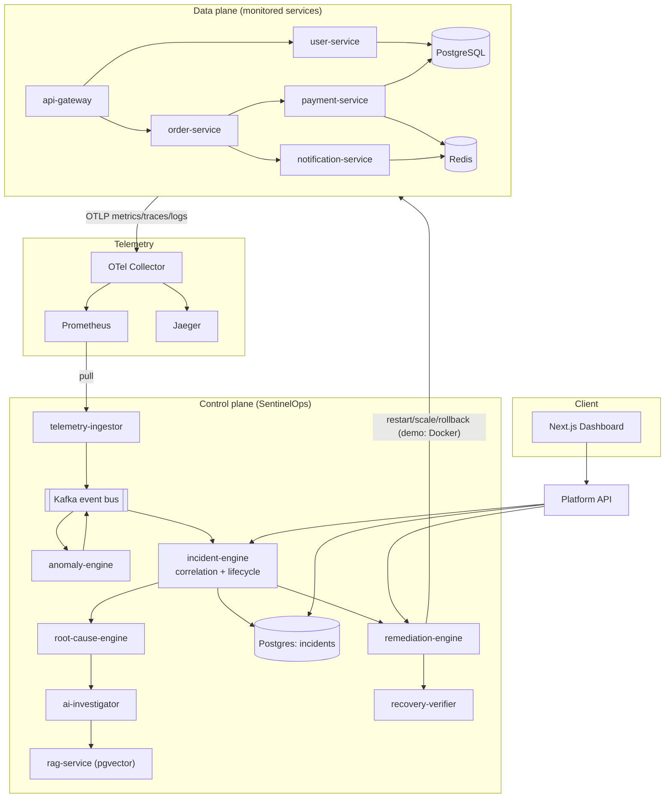

# 01 · System Overview

## What SentinelOps is

SentinelOps is a **software-system doctor**. It watches a fleet of microservices,
detects abnormal behaviour from real telemetry, correlates related anomalies into a
single **incident**, reasons about the **root cause**, explains it with an LLM
grounded in retrieved runbooks, proposes **remediation**, gates risky actions behind
**human approval**, executes approved actions, and **verifies recovery** — then
drafts an incident report and postmortem.

It is deliberately **not** a CRUD dashboard, a static monitoring mock, or an "AI
wrapper". Telemetry actually flows, Kafka actually transports events, Postgres
actually stores state, and anomaly detection runs on collected data.

## The four things it must do well

1. **Observe** — collect metrics, logs, and traces from every service (OpenTelemetry).
2. **Detect** — find anomalies with statistics + ML, not guesswork or random scores.
3. **Reason** — correlate anomalies into incidents, rank root-cause hypotheses, and
   explain them with evidence-grounded AI.
4. **Respond** — recommend and (after human approval) execute remediation, then
   confirm the system recovered.

## Design principles

These principles constrain every later decision. They are the reason the system is
credible rather than a demo.

| Principle | What it means in practice |
| --- | --- |
| **Real data flow** | No static JSON pretending to be live. A fault physically changes a service's behaviour; metrics move because the system actually slowed down. |
| **Deterministic detection, LLM reasoning** | Numeric anomaly detection uses z-score / EWMA / Isolation Forest. LLMs are used only for explanation, retrieval, summarization, and report drafting — and every claim they make must cite collected evidence. See [ADR-0004](../development/decisions/adr-0004-detection-vs-reasoning.md). |
| **Human-in-the-loop** | Dangerous remediation requires an ENGINEER/ADMIN approval and is fully audited. |
| **Self-observability** | SentinelOps emits its own metrics (detection latency, events processed, AI latency, remediation success rate). |
| **Fail-safe over fail-fast for observability** | If the OTel collector is down, services still boot and serve; tracing is best-effort. Observability never takes down the thing it observes. |

## The two planes

The system is split into two planes with a clean boundary between them.

### Data plane — "the patient"
The demo microservices being monitored. They generate realistic traffic, emit
telemetry, and can be made to fail on demand.

`api-gateway` → `user-service` / `order-service` → `payment-service` →
`notification-service`, backed by **PostgreSQL**, **Redis**, and **Kafka**.

Every data-plane service is built from one shared template,
[`@sentinelops/service-kit`](../packages/service-kit.md), so they all expose the same
health, metrics, tracing, and fault-injection surface.

### Control plane — "the doctor"
The SentinelOps intelligence pipeline that watches the data plane:

telemetry ingestion → anomaly detection → correlation → incident management →
root-cause analysis → RAG + AI investigation → remediation → recovery verification,
plus the platform API and the Next.js dashboard.

## Component map

## Technology at a glance

| Area | Technology | Why |
| --- | --- | --- |
| Data-plane & most control-plane services | Node.js + TypeScript (Fastify) | Fast, strongly-typed, great OTel support |
| ML / AI services | Python + FastAPI | scikit-learn ecosystem for Isolation Forest, embeddings |
| Persistence | PostgreSQL (+ pgvector) | Relational integrity for incidents + vector search for RAG in one store |
| Cache / queues | Redis | Idempotency sets, notification queue |
| Event bus | Apache Kafka (KRaft) | Decouples detection→correlation→remediation; replayable, partitioned |
| Tracing/metrics/logs | OpenTelemetry → Collector | Vendor-neutral instrumentation, one pipeline |
| Metrics store / dashboards | Prometheus + Grafana | Standard SRE tooling |
| Trace store | Jaeger | Distributed trace inspection |
| Infra | Docker, Kubernetes, Terraform | Local → cluster → AWS, same artifacts |

See the [consolidated ARCHITECTURE.md](ARCHITECTURE.md) for the full diagram set and
the [roadmap](../development/00-roadmap.md) for build status.
