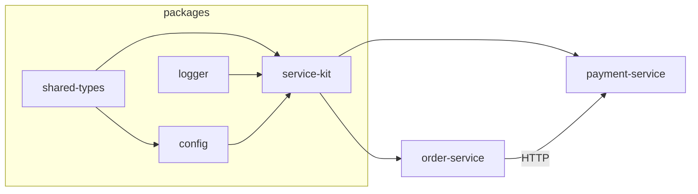

# 02 · Service Responsibilities

Every service has a single, well-defined responsibility, a defined set of inputs and
outputs, and explicit dependencies. This page is the contract catalogue.

Legend: ✅ implemented · 🟡 partial · ⚪ planned

---

## Data plane (the monitored services)

All data-plane services are built from [`service-kit`](../packages/service-kit.md),
so they **all** expose: `GET /health`, `/health/ready`, `/health/live`,
`GET /metrics` (Prometheus), and `/admin/faults` (fault injection). Ports come from
`.env` (see [`.env.example`](../../.env.example)).

### api-gateway ✅
- **Responsibility**: single entry point; routes external requests to user/order
  services; propagates trace context and request ids.
- **Port**: 8080
- **Depends on**: user-service, order-service.
- **Emits**: request rate, latency, 4xx/5xx, traces spanning downstream calls.
- **Code**: [`services/api-gateway/src/app.ts`](../../services/api-gateway/src/app.ts) · **Docs**: [api-gateway](../services/api-gateway.md)

### user-service ✅
- **Responsibility**: user records and auth lookups.
- **Port**: 8081
- **Depends on**: PostgreSQL (simulated).
- **Emits**: DB query latency.
- **Code**: [`services/user-service/src/app.ts`](../../services/user-service/src/app.ts) · **Docs**: [user-service](../services/user-service.md)

### order-service ✅
- **Responsibility**: orchestrates order creation — writes an order, then calls
  payment-service over HTTP, then (planned) notification-service.
- **Port**: 8082
- **Depends on**: payment-service (HTTP), PostgreSQL (simulated).
- **Emits**: fan-out traces, error rate, DB latency.
- **Code**: [`services/order-service/src/app.ts`](../../services/order-service/src/app.ts)
- **Docs**: [order-service](../services/order-service.md)

### payment-service ✅ · *primary failure target*
- **Responsibility**: charges an order; heavy PostgreSQL + Redis user.
- **Port**: 8083
- **Depends on**: PostgreSQL (simulated hot path), Redis (idempotency).
- **Emits**: `db_pool_utilization`, `db_query_latency_ms`, request latency, 500 rate.
- **Code**: [`services/payment-service/src/app.ts`](../../services/payment-service/src/app.ts)
- **Docs**: [payment-service](../services/payment-service.md)

### notification-service ✅
- **Responsibility**: sends notifications via a Redis-backed queue.
- **Port**: 8084
- **Depends on**: Redis (simulated).
- **Emits**: `queue_depth`, `redis_latency_ms`.
- **Code**: [`services/notification-service/src/app.ts`](../../services/notification-service/src/app.ts) · **Docs**: [notification-service](../services/notification-service.md)

---

## Control plane (SentinelOps intelligence)

### telemetry-ingestor ⚪ *(planned — Phase 5)*
- **Responsibility**: pulls Prometheus metrics + consumes raw telemetry, normalizes
  into `metrics.events` / `log.events`.
- **Inputs**: Prometheus HTTP API, `telemetry.events` topic.
- **Outputs**: `metrics.events`, `log.events`.

### anomaly-engine ⚪ *(planned — Phase 6, Python)*
- **Responsibility**: maintains per-metric baselines; runs z-score / EWMA +
  Isolation Forest; emits scored anomalies.
- **Inputs**: `metrics.events`.
- **Outputs**: `anomaly.events` (see the `Anomaly` type in
  [shared-types](../packages/shared-types.md)).

### incident-engine ⚪ *(planned — Phase 7)*
- **Responsibility**: **correlates** many anomalies into one incident (time window +
  dependency graph + trace ids); owns the incident lifecycle state machine; persists
  to Postgres.
- **Inputs**: `anomaly.events`, `log.events`, `recovery.events`.
- **Outputs**: `incident.events`, `incidents` / `incident_events` tables.
- **Design**: [Incident Lifecycle](07-incident-lifecycle.md).

### root-cause-engine ⚪ *(planned — Phase 9)*
- **Responsibility**: ranks causal hypotheses using the dependency graph, evidence
  weights, and the deploy timeline; produces a confidence-scored root cause.
- **Inputs**: an incident + its evidence + `service_dependencies` + `deployments`.
- **Outputs**: a `RootCauseHypothesis` attached to the incident.

### rag-service ⚪ *(planned — Phase 10, Python)*
- **Responsibility**: chunk → embed → store/retrieve over runbooks and past incidents
  in pgvector.
- **Inputs**: markdown docs under `docs/` + incident context.
- **Outputs**: ranked document chunks for the investigator.

### ai-investigator ⚪ *(planned — Phase 11, Python)*
- **Responsibility**: builds a grounded incident narrative + recommended actions
  using retrieved docs + evidence via an LLM (mockable, no key required).
- **Inputs**: incident id → metrics, logs, traces, graph, deployments, retrieved docs.
- **Outputs**: explanation, alternative hypotheses, recommended actions with risk.

### remediation-engine ⚪ *(planned — Phase 12)*
- **Responsibility**: executes approval-gated actions (restart/scale/clear-cache/
  rollback/pool-increase) against the demo Docker environment; records audit.
- **Inputs**: approved `remediation_actions`.
- **Outputs**: `remediation.events`, action results, `audit_log` rows.

### recovery-verifier ⚪ *(planned — Phase 12)*
- **Responsibility**: after remediation, watches metrics for N windows; confirms
  recovery or escalates back to `MITIGATION_REQUIRED`.
- **Inputs**: post-remediation metrics.
- **Outputs**: `recovery.events`, `recovery_checks` rows.

---

## Application layer

### platform-api (`apps/api`) ⚪ *(planned — Phase 15)*
- **Responsibility**: REST/WebSocket gateway for the dashboard; JWT auth + RBAC;
  reads incidents/services/metrics; triggers investigate/remediate/approve/failures.
- **Port**: 4000.
- **Security**: [Security & RBAC](09-security-and-rbac.md).

### web (`apps/web`) ⚪ *(planned — Phase 14)*
- **Responsibility**: the Next.js SRE dashboard (overview, services, incidents,
  architecture graph, failure console, runbooks).
- **Port**: 3000.

---

## Shared packages

| Package | Responsibility | Doc |
| --- | --- | --- |
| `@sentinelops/shared-types` ✅ | Event envelope, enums, domain models (zod) | [shared-types](../packages/shared-types.md) |
| `@sentinelops/logger` ✅ | Structured JSON logging with redaction | [logger](../packages/logger.md) |
| `@sentinelops/config` ✅ | Validated env + configurable severity engine | [config](../packages/config.md) |
| `@sentinelops/service-kit` ✅ | Fastify + OTel + metrics + fault controller | [service-kit](../packages/service-kit.md) |

## Dependency summary

