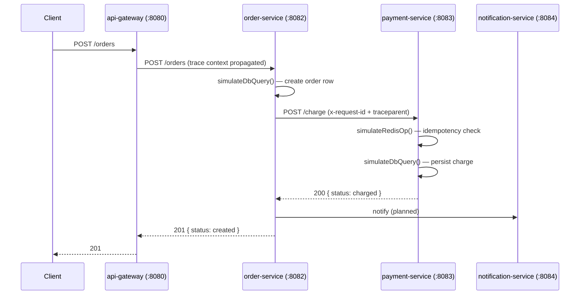
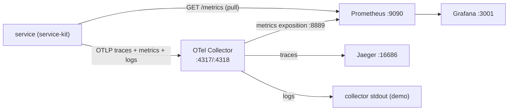
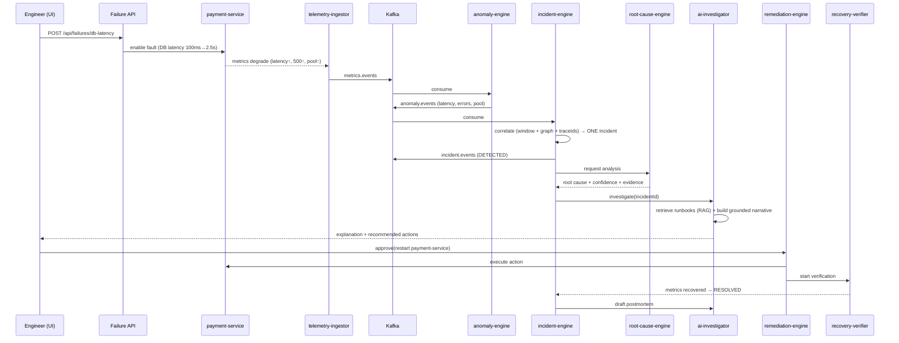
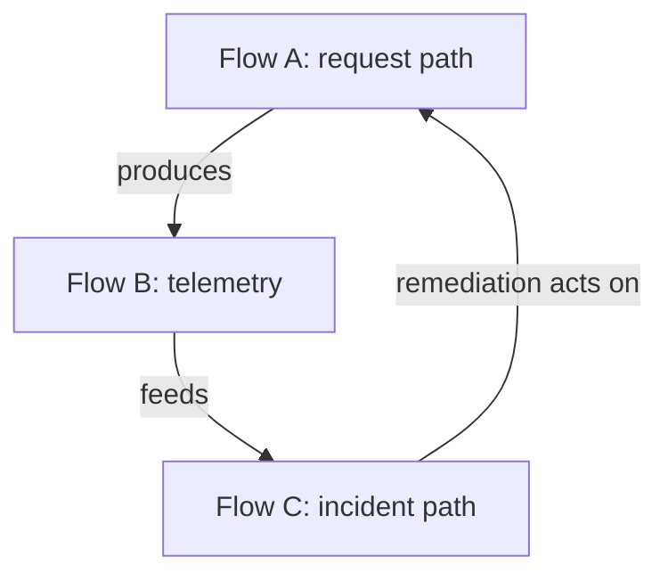

# 03 · Data Flow

This page traces the three journeys that matter: a **request**, its **telemetry**,
and the **incident** that telemetry can trigger. Understanding these three flows is
understanding the whole system.

---

## Flow A — The request path (data plane)

A user action fans out across services and produces one distributed trace.

Implementation notes:
- The `OS → PS` hop is a **real HTTP call** (`fetch` in
  [`order-service/src/app.ts`](../../services/order-service/src/app.ts)). OpenTelemetry
  auto-instrumentation propagates `traceparent`, so Jaeger shows one trace spanning
  both services.
- `simulateDbQuery` / `simulateRedisOp` live in
  [`service-kit/src/server.ts`](../../packages/service-kit/src/server.ts). They apply
  realistic latency (baseline + jitter + any injected fault) and record the
  `db_query_latency_ms` / `redis_latency_ms` / `db_pool_utilization` metrics. They are
  the seam where **faults become real latency**.

## Flow B — The telemetry path (data plane → observability)

Every service continuously emits three signal types.

Two metric routes exist by design (redundancy + flexibility):
1. **Push**: services export OTLP metrics to the Collector, which re-exposes them on
   `:8889` for Prometheus to scrape.
2. **Pull**: Prometheus also scrapes each service's own `/metrics` endpoint directly
   (see [`prometheus.yml`](../../monitoring/prometheus/prometheus.yml)). This path
   works even if the Collector is down.

See [Observability](06-observability.md) for the full metric/log/trace catalogue.

## Flow C — The incident path (control plane)

This is the heart of SentinelOps: telemetry becomes an anomaly, anomalies become one
incident, and the incident is reasoned about and resolved. *(Control-plane services
are planned in Phases 5–12; the flow is fixed now so their contracts are stable.)*

### Why Kafka sits in the middle
Each stage (detect → correlate → reason → remediate) is a separate consumer group.
This means:
- Stages scale independently (more anomaly-engine instances without touching
  incident-engine).
- A slow or crashed stage doesn't drop data — Kafka retains it for replay.
- New consumers (e.g. an analytics sink) can be added without changing producers.

See [Kafka Event Design](05-kafka-event-design.md) for topic contracts.

## How the flows connect

- A **request** (Flow A) generates **telemetry** (Flow B).
- **Telemetry** feeds detection and the **incident path** (Flow C).
- **Remediation** at the end of Flow C acts back on the services in Flow A
  (restart/scale/rollback), closing the loop — and **recovery verification** watches
  Flow B again to confirm the fix worked.

This closed loop — observe → detect → reason → act → verify — is the entire product.
