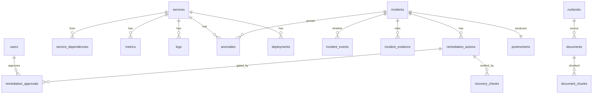

# 04 · Database Design

**Store**: PostgreSQL 16 with the `vector` (pgvector) and `pgcrypto` extensions.
**Schema source of truth**: [`infrastructure/db/migrations/0001_init.sql`](../../infrastructure/db/migrations/0001_init.sql).
**Domain type mirror**: the TypeScript models in
[shared-types](../packages/shared-types.md) mirror these tables.

Why one relational database (not a separate vector DB): incidents need relational
integrity (foreign keys, transactions), and RAG needs vector search. pgvector gives
both in one store, which keeps the local footprint small and the demo simple. See
[ADR context in the roadmap](../development/00-roadmap.md).

---

## Entity relationships

---

## Tables by domain

### Identity / RBAC
| Table | Purpose | Notable columns |
| --- | --- | --- |
| `users` | Operators and their roles | `role ∈ {VIEWER, ENGINEER, ADMIN}`, `password_hash` |

### Service catalogue
| Table | Purpose | Notable columns |
| --- | --- | --- |
| `services` | The registry of monitored services | `id` (e.g. `payment-service`), `tier`, `health` |
| `service_dependencies` | Directed edges of the dependency graph | `from_service`→`to_service`, rolling `call_rate`/`error_rate`/`p95_latency_ms` |
| `deployments` | Deploy timeline (root-cause "what changed") | `service_id`, `version`, `deployed_at` |

### Telemetry (time-series)
| Table | Purpose | Notable columns |
| --- | --- | --- |
| `metrics` | Raw metric samples | `service_id`, `metric`, `value`, `labels jsonb`, `ts` |
| `logs` | Structured log records | `level`, `message`, `trace_id`, `error`, `fields jsonb` |
| `traces` | Span records (mirror of Jaeger for querying) | `trace_id`+`span_id` PK, `parent_id`, `duration_ms` |
| `anomalies` | Detected anomalies | `anomaly_score`, `method`, `baseline`, `deviation`, `incident_id` |

### Incidents
| Table | Purpose | Notable columns |
| --- | --- | --- |
| `incidents` | One row per correlated incident | `id` (`INC-1042`), `status`, `severity`, `affected_services[]`, `root_cause jsonb`, `confidence`, unique `correlation_id` |
| `incident_events` | The timeline (append-only) | `kind`, `message`, `at`, `data jsonb` |
| `incident_evidence` | Evidence the AI/root-cause cite | `kind`, `summary`, `data jsonb`, `weight` |

### Remediation
| Table | Purpose | Notable columns |
| --- | --- | --- |
| `remediation_actions` | Proposed/executed actions | `type`, `target_service`, `risk`, `status`, `requires_approval`, `result jsonb` |
| `remediation_approvals` | Human approval decisions | `user_id`, `decision ∈ {APPROVED, REJECTED}`, `reason` |
| `recovery_checks` | Post-remediation metric checks | `metric`, `observed`, `baseline`, `passed` |

### Knowledge base (RAG)
| Table | Purpose | Notable columns |
| --- | --- | --- |
| `runbooks` | Logical runbook grouping | `slug`, `category` |
| `documents` | Source markdown documents | `source_path`, `content_md` |
| `document_chunks` | Embedded chunks for retrieval | `embedding vector(384)`, `content`, `chunk_index` |

### Postmortem & audit
| Table | Purpose | Notable columns |
| --- | --- | --- |
| `postmortems` | AI-drafted postmortem per incident | `content_md` |
| `audit_log` | Every sensitive action | `actor`, `action`, `target`, `result`, `data jsonb` |

---

## Indexing strategy (and why)

Indexes are chosen for the actual query patterns, not blanket-added.

| Index | Table | Type | Serves |
| --- | --- | --- | --- |
| `idx_metrics_ts_brin` | `metrics` | **BRIN** on `ts` | Append-only time-series ordered by time; BRIN is tiny and ideal here. |
| `idx_metrics_service_metric_ts` | `metrics` | btree `(service_id, metric, ts DESC)` | "Latest N samples of metric X for service Y" — the anomaly-engine's read. |
| `idx_logs_service_ts`, `idx_logs_trace` | `logs` | btree | Service log tailing; trace-correlated log lookup. |
| `idx_incidents_status_sev` | `incidents` | btree `(status, severity)` | Dashboard "open incidents by severity". |
| `uq_incidents_correlation` | `incidents` | **unique** `correlation_id` | **Idempotent incident creation** — the correlation key can't create duplicates under a race. |
| `idx_incident_evidence_data` | `incident_evidence` | **GIN** on `data jsonb` | Querying structured evidence. |
| `idx_chunks_embedding` | `document_chunks` | **ivfflat** `vector_cosine_ops` | Approximate nearest-neighbour retrieval for RAG. |

## Idempotency & consistency notes

- **Incident dedupe** relies on the unique `correlation_id`. The incident-engine
  computes a stable correlation key (service + window bucket + signal class) and does
  an `INSERT ... ON CONFLICT (correlation_id) DO UPDATE`, so duplicate anomaly events
  never spawn duplicate incidents.
- **Time-series tables** (`metrics`, `logs`) use identity primary keys and are
  append-only; they are safe to prune by time (`retention` is handled operationally).
- **Evidence and events** are append-only children of an incident and cascade-delete
  with it.

## Migrations

Migrations are plain, ordered SQL files under
`infrastructure/db/migrations/` (`0001_init.sql`, `0002_*`, …). They are applied by a
small migration runner *(the `db:migrate` script; runner lands with Phase 4)*. Every
statement is written to be safe to re-run (`CREATE ... IF NOT EXISTS`).
