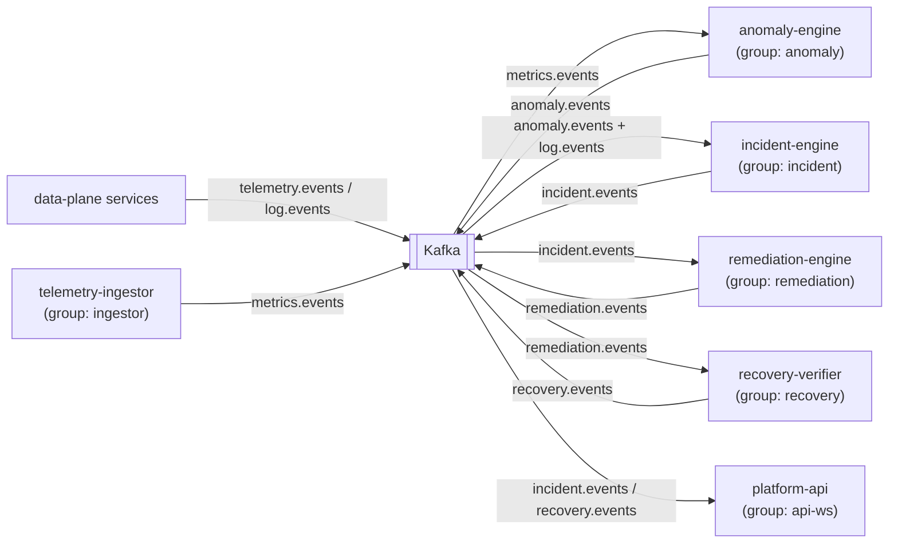

# 05 · Kafka Event Design

Kafka is the **backbone of the control plane**. Detection, correlation, reasoning,
and remediation are decoupled stages connected only by topics. This page defines the
topic contracts so every producer and consumer agrees.

**Broker**: Apache Kafka 3.8 in **KRaft mode** (no ZooKeeper) — see
[`docker-compose.infra.yml`](../../infrastructure/docker/docker-compose.infra.yml).
**Topic constants**: the single source of truth is `Topics` in
[shared-types](../packages/shared-types.md) — services import it, never hard-code
strings.

---

## The event envelope

Every message on every topic is wrapped in one envelope
(`EventEnvelopeSchema` / `makeEnvelope()` in
[`shared-types/src/events.ts`](../../packages/shared-types/src/events.ts)):

```jsonc
{
  "eventId": "uuid",          // unique per event → used for idempotent consumption
  "type": "LATENCY_ANOMALY",  // EventType discriminator
  "timestamp": "ISO-8601",
  "service": "payment-service",
  "traceId": "optional — set when the event comes from a request path",
  "correlationId": "optional — set by the correlation engine to group events",
  "version": 1,               // schema version for forward-compatible consumers
  "payload": { /* type-specific */ }
}
```

Why an envelope: consumers can route, dedupe (`eventId`), correlate (`traceId` /
`correlationId`), and evolve (`version`) **without parsing the payload first**.

---

## Topics

Naming: `<domain>.<name>`, lowercase. Default 3 partitions. Keyed by `service` (so a
service's events keep order) except lifecycle topics keyed by `incidentId`.

| Topic | Producer(s) | Consumer(s) | Key | Payload |
| --- | --- | --- | --- | --- |
| `telemetry.events` | data-plane services | telemetry-ingestor | `service` | raw telemetry sample |
| `metrics.events` | telemetry-ingestor | anomaly-engine | `service` | `MetricSample` (windowed) |
| `log.events` | data-plane services | incident-engine, ai-investigator | `service` | `LogRecord` (esp. WARN/ERROR) |
| `anomaly.events` | anomaly-engine | incident-engine | `service` | `Anomaly` (scored) |
| `incident.events` | incident-engine | platform-api (WS), remediation-engine, ai-investigator | `incidentId` | lifecycle transition |
| `remediation.events` | remediation-engine | recovery-verifier, platform-api | `incidentId` | action requested/approved/executed |
| `recovery.events` | recovery-verifier | incident-engine, platform-api | `incidentId` | recovery verification result |
| `deadletter.events` | any consumer | ops tooling | original key | poison message + error context |

The payload schemas (`MetricSample`, `LogRecord`, `Anomaly`) are defined and
zod-validated in [shared-types](../packages/shared-types.md).

---

## Partitioning & ordering

- **Key = `service`** on telemetry/metrics/anomaly topics ⇒ all events for one
  service land on the same partition ⇒ **per-service ordering** is preserved (the
  anomaly-engine sees a service's samples in time order).
- **Key = `incidentId`** on lifecycle topics ⇒ all events for one incident are
  ordered, so a `RESOLVED` can never be processed before its `DETECTED`.
- 3 partitions per topic by default lets us run up to 3 parallel consumers per group.

## Delivery guarantees

| Concern | Approach |
| --- | --- |
| **At-least-once** | Consumers commit offsets **after** processing, not before. A crash re-delivers, never drops. |
| **Idempotency** | Each consumer records processed `eventId`s in a Redis set with TTL; a re-delivered event is a no-op. Incident creation additionally dedupes on `correlation_id` (unique index). |
| **Retries** | Transient failures retry with exponential backoff (capped). |
| **Poison messages** | After max retries, the message is published to `deadletter.events` with the error and original topic, then the offset is committed so the pipeline keeps moving. |
| **Backpressure** | Consumer groups + partition count bound in-flight work; slow stages lag rather than overwhelm downstream. |

## Consumer-group map



Each box is an independent consumer group, so each stage scales and fails
independently. Adding a new sink (analytics, alerting) means adding a new group — no
producer changes.

## Why not call services directly (HTTP) instead of Kafka?

Direct calls couple stages: if the incident-engine is down, detection would block or
drop. With Kafka, detection keeps producing; the incident-engine catches up on
restart by replaying from its committed offset. This is what makes the pipeline
resilient enough to be believable as an SRE tool. *(The data-plane request path still
uses HTTP — that's a synchronous user request, not a pipeline stage.)*
