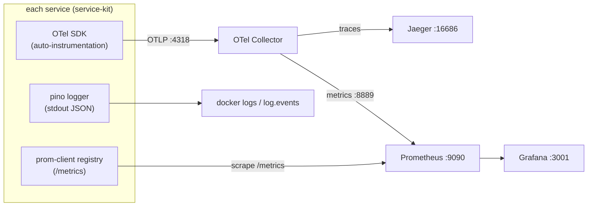

# 06 · Observability

SentinelOps can only detect what it can see. This page defines the three signal types
(metrics, logs, traces), how they are produced, and where they go. All three are
produced by [`service-kit`](../packages/service-kit.md), so every service is
instrumented identically.



---

## Metrics

Two production paths (see [Data Flow B](03-data-flow.md#flow-b--the-telemetry-path-data-plane--observability)):
1. **prom-client** exposes `GET /metrics` on every service — always available, scraped
   by Prometheus directly.
2. **OTel SDK** exports metrics over OTLP to the Collector, re-exposed on `:8889`.

### Metric catalogue

Defined in [`service-kit/src/metrics.ts`](../../packages/service-kit/src/metrics.ts).
All carry a `service` label.

| Metric | Type | Labels | Meaning |
| --- | --- | --- | --- |
| `http_request_duration_ms` | Histogram | `method`, `route`, `status` | Request latency; buckets 5ms…6s. Source of p50/p95/p99. |
| `http_requests_total` | Counter | `method`, `route`, `status` | Request count → request rate, error rate by status. |
| `http_request_errors_total` | Counter | `method`, `route` | 5xx count. |
| `db_pool_utilization` | Gauge | — | Fraction of DB pool in use (0..1). **Rises with query latency** — the pool-exhaustion signal. |
| `db_query_latency_ms` | Histogram | — | Simulated DB query latency. |
| `redis_latency_ms` | Histogram | — | Redis op latency. |
| `queue_depth` | Gauge | — | Pending work items (driven by kafka-lag fault). |
| `cpu_usage` | Gauge | — | Real process CPU fraction (from `process.cpuUsage()`). |
| `memory_usage` | Gauge | — | Real resident memory (`process.memoryUsage().rss`). |
| *default process metrics* | various | — | Event-loop lag, GC, handles (prom-client `collectDefaultMetrics`). |

### Deriving the "golden signals"
- **Latency**: `histogram_quantile(0.95, rate(http_request_duration_ms_bucket[1m]))`.
- **Traffic**: `sum(rate(http_requests_total[1m])) by (service)`.
- **Errors**: `sum(rate(http_requests_total{status=~"5.."}[1m])) / sum(rate(http_requests_total[1m]))`.
- **Saturation**: `db_pool_utilization`, `cpu_usage`, `queue_depth`.

These four are exactly what the anomaly-engine baselines and the severity model
consumes (see [Severity Model](08-severity-model.md)).

---

## Logs

Structured JSON via [`logger`](../packages/logger.md) (pino). Every line carries
`timestamp`, `service`, `level`, `message`, and per-request `requestId` / `traceId`
where available. Example (an injected failure):

```json
{
  "level": "ERROR",
  "time": "2026-09-21T21:47:03.123Z",
  "service": "payment-service",
  "requestId": "8f3c…",
  "route": "/charge",
  "status": 500,
  "durationMs": 12.4,
  "message": "request failed"
}
```

Secrets (`password`, `token`, `authorization`, `apiKey`, …) are **redacted** by the
logger before serialization — see [ADR/Security](09-security-and-rbac.md).

Logs are shipped two ways: to stdout (captured by `docker logs`) and, for WARN/ERROR,
onto the `log.events` Kafka topic where the incident-engine and ai-investigator
consume them as evidence.

---

## Traces

OpenTelemetry **auto-instrumentation** wraps `http`, `fastify`, `pg`, `redis`, and
`kafkajs`, so spans are produced without manual code. The bootstrap is
[`service-kit/src/telemetry.ts`](../../packages/service-kit/src/telemetry.ts), started
**before** the app imports those libraries (see
[ADR-0002](../development/decisions/adr-0002-tsx-runtime-no-build.md) for the
ordering mechanism).

A `POST /orders` produces a trace like:

```
api-gateway POST /orders
└─ order-service POST /orders
   ├─ order-service db.query (create order)
   └─ order-service HTTP POST → payment-service /charge
      ├─ payment-service redis.get (idempotency)
      └─ payment-service db.query (persist charge)
```

Traces are exported over OTLP to the Collector, which forwards them to Jaeger. When a
service is slow under a fault, the offending span widens visibly in Jaeger — the same
degradation the metrics show.

### Best-effort by design
If the Collector is unreachable, `telemetry.ts` catches the error, logs a warning,
and the service **still boots and serves**. Observability must never take down the
system it observes. The `/metrics` pull path remains available regardless.

---

## SentinelOps observing itself

The control-plane services expose their own metrics (planned, Phase 5+):
`incident_detection_latency`, `events_processed`, `events_failed`,
`kafka_consumer_lag`, `ai_analysis_latency`, `remediation_success_rate`,
`recovery_verification_time`. These prove the platform is healthy and are surfaced on
a dedicated Grafana row.

## Where to look

| Question | Tool | URL |
| --- | --- | --- |
| Are metrics flowing? | Prometheus | http://localhost:9090 |
| What does a dashboard show? | Grafana | http://localhost:3001 |
| Why was one request slow? | Jaeger | http://localhost:16686 |
| What did a service log? | `docker logs <container>` | — |

See the [Observability Stack guide](../guides/02-observability-stack.md) for a
walkthrough.
