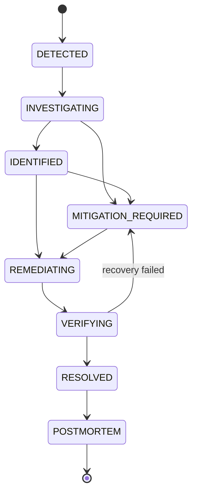

# 07 · Incident Lifecycle

An incident is the central object of SentinelOps. It is born from correlated
anomalies, moves through a strict state machine, and dies as a postmortem. This page
defines the states, the legal transitions, and what happens in each.

**Types**: `IncidentStatus`, `INCIDENT_TRANSITIONS` in
[`shared-types/src/enums.ts`](../../packages/shared-types/src/enums.ts).
**Storage**: `incidents` + `incident_events` (see [Database Design](04-database-design.md)).

---

## The state machine



Transitions are enforced in code by the `INCIDENT_TRANSITIONS` map. The incident-engine
is the **only** component allowed to change status, and every transition:
1. validates the move is legal,
2. writes an `incident_events` row (the timeline), and
3. emits an `incident.events` Kafka message.

An illegal transition is rejected — you cannot jump from `DETECTED` straight to
`RESOLVED`.

---

## What each state means

| State | Meaning | Entered by | Produces |
| --- | --- | --- | --- |
| `DETECTED` | Anomalies correlated into a new incident | incident-engine (on `anomaly.events`) | incident row, severity, affected services |
| `INVESTIGATING` | Gathering evidence, running root-cause | incident-engine → root-cause-engine | `incident_evidence` rows |
| `IDENTIFIED` | A ranked root cause with confidence exists | root-cause-engine | `root_cause`, `confidence` |
| `MITIGATION_REQUIRED` | A remediation is proposed and awaits approval | ai-investigator / remediation-engine | `remediation_actions` (PROPOSED) |
| `REMEDIATING` | An approved action is executing | remediation-engine (post-approval) | `remediation.events` |
| `VERIFYING` | Watching metrics to confirm recovery | recovery-verifier | `recovery_checks` |
| `RESOLVED` | Metrics recovered for N windows | recovery-verifier | `resolved_at` |
| `POSTMORTEM` | AI-drafted report attached | ai-investigator | `postmortems.content_md` |

The `VERIFYING → MITIGATION_REQUIRED` edge is the important safety valve: if the fix
didn't work, the incident does **not** resolve — it loops back for another action.

---

## The timeline

Every transition and significant event appends to `incident_events`, giving a precise,
replayable history like the demo scenario:

```
10:31:17  DB latency increases              (evidence)
10:31:22  HTTP 500 rate increases           (evidence)
10:31:25  anomaly detected                  (anomaly.events)
10:31:26  incident INC-1042 created         (DETECTED)
10:31:29  root-cause analysis started       (INVESTIGATING)
10:31:33  DB pool exhaustion identified     (IDENTIFIED, confidence 0.91)
10:31:36  AI recommends restart             (MITIGATION_REQUIRED)
10:31:42  engineer approves restart         (approval)
10:31:47  payment-service restarted         (REMEDIATING)
10:31:53  metrics recovering                (VERIFYING)
10:31:58  incident resolved                 (RESOLVED)
```

The dashboard renders this as a vertical timeline on the incident detail page.

---

## Idempotent creation

Detection can emit the "same" incident-worthy signal multiple times (retries,
overlapping windows). To avoid duplicate incidents, the engine computes a stable
**`correlation_id`** from the correlated signal set and relies on the unique index
`uq_incidents_correlation`:

```sql
INSERT INTO incidents (id, correlation_id, ...) VALUES (...)
ON CONFLICT (correlation_id) DO UPDATE SET updated_at = now()
RETURNING *;
```

So a burst of anomalies for one root cause converges on **one** incident, matching the
correlation requirement in the spec.

---

## Correlation: why many anomalies become one incident

The engine groups anomalies that are likely the same event using four signals:

1. **Time window** — anomalies within a sliding window (e.g. 60s).
2. **Dependency graph** — anomalies on services connected by `service_dependencies`
   (a DB issue explains downstream payment + order anomalies).
3. **Trace relationship** — anomalies sharing `traceId`s from the same request paths.
4. **Metric relationship** — related metrics (latency↑ ⇒ pool↑ ⇒ errors↑).

Result: `payment latency`, `payment errors`, `db connections`, `db latency` collapse
into **one** incident with `payment-service` (and its DB) as affected services — not
four separate alerts. Full algorithm ships in Phase 7; the contract is fixed here.
