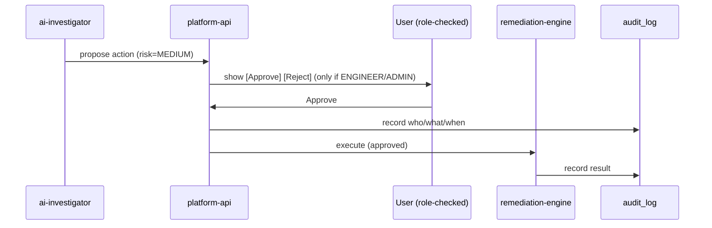

# 09 · Security & RBAC

SentinelOps can restart services and roll back deployments — so authorization and
audit are first-class, not afterthoughts. This page defines the security model.
*(Enforcement lands with the platform API in Phase 15; the model is fixed now.)*

---

## Authentication

- **JWT** bearer tokens issued by the platform API on login.
- Secret and expiry come from env (`JWT_SECRET`, `JWT_EXPIRES_IN`) — never hard-coded,
  never logged. See [`config`](../packages/config.md).
- Passwords are stored as hashes only (`users.password_hash`); the plaintext never
  touches the database or logs.

## Authorization — roles

`Role` in [`shared-types`](../packages/shared-types.md): `VIEWER`, `ENGINEER`,
`ADMIN`.

| Capability | VIEWER | ENGINEER | ADMIN |
| --- | --- | --- | --- |
| View dashboards, incidents, metrics, traces | ✅ | ✅ | ✅ |
| Trigger AI investigation | ✅ | ✅ | ✅ |
| Trigger failure injection (demo) | — | ✅ | ✅ |
| **Approve/reject remediation** | — | ✅ | ✅ |
| Execute remediation | — | ✅ | ✅ |
| Manage users / settings / severity rules | — | — | ✅ |

The rule that matters most: **only ENGINEER and ADMIN can approve remediation.** A
VIEWER can watch everything but cannot cause a change to production.

## Human-in-the-loop remediation gate

- **Risky actions require approval** (`remediation_actions.requires_approval`).
  Low-risk, reversible actions (e.g. `clear_cache`) may be auto-approved by policy;
  restart/scale/rollback always require a human.
- Approvals are recorded in `remediation_approvals` (`user_id`, `decision`, `reason`,
  `decided_at`).

## Audit trail

Every sensitive action writes to `audit_log`: **who** (`actor`), **what** (`action`,
`target`), **when** (`at`), and the **result**. This covers approvals, executions,
failure injections, and settings changes — a complete, queryable history for
postmortems and compliance.

## Secrets handling

| Rule | Enforcement |
| --- | --- |
| No secrets in code | All config via env (`.env`, container env). `.env` is git-ignored; `.env.example` documents keys with dummy values. |
| No secrets in logs | The [logger](../packages/logger.md) redacts `password`, `token`, `authorization`, `apiKey`, and nested variants before writing. |
| No secrets in URLs | Sensitive data is never placed in query strings (relevant once the API + web exist). |
| LLM keys optional | The AI layer defaults to a `mock` provider, so the system runs with **no** API key; real keys are injected via env only when desired. |

## Network / transport (deployment)

- Local dev is plaintext on localhost.
- Kubernetes (Phase 17) uses `Secret` objects for credentials and can front services
  with TLS at the ingress.
- Terraform/AWS (Phase 18) places data stores in private subnets with security groups
  scoped to the services that need them; no database is internet-exposed.

## Threat-model highlights

| Threat | Mitigation |
| --- | --- |
| Unauthorized remediation | RBAC gate + approval + audit |
| Replayed/duplicate events causing double action | `eventId` idempotency + `correlation_id` unique index |
| Secret leakage via logs | Logger redaction |
| A compromised LLM prompt injecting actions | The LLM only **recommends**; execution requires a human approval and is constrained to a fixed action allow-list (`RemediationActionType`). |
| Observability outage masking problems | Dual metric paths (push + pull); services degrade gracefully. |
