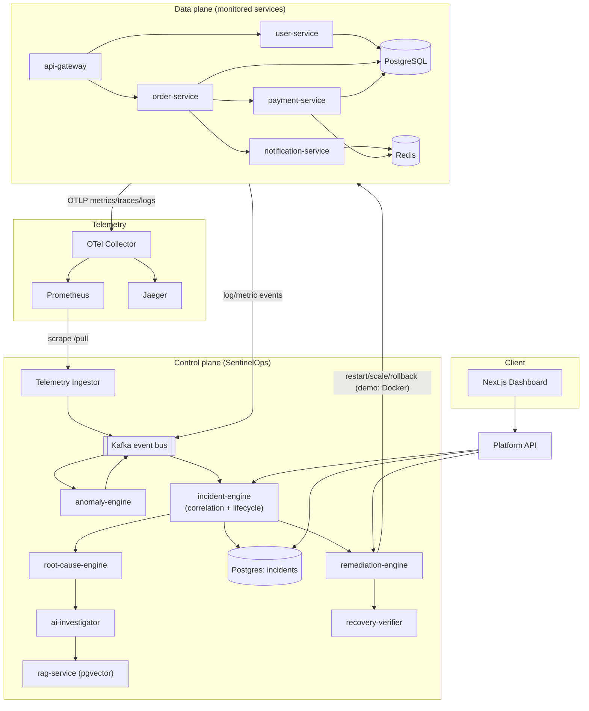
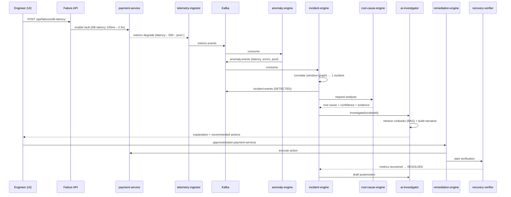
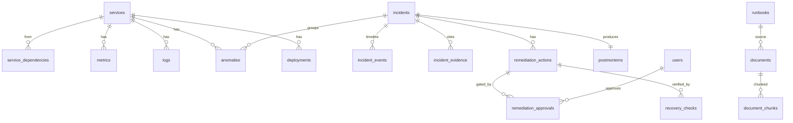

# SentinelOps — System Architecture

> AI-Powered Distributed Observability & Autonomous Incident Response Platform

This document is the authoritative design reference. It is written **before** the
code so every service, table, and topic has a defined responsibility and contract.

---

## 1. Design goals

SentinelOps is a "software-system doctor". It continuously observes a fleet of
microservices, detects abnormal behaviour from **real telemetry**, correlates
related anomalies into a single **incident**, reasons about the **root cause**,
explains it with an LLM grounded in retrieved runbooks, proposes **remediation**,
gates risky actions behind **human approval**, executes approved actions, and
**verifies recovery** — producing an incident report and postmortem.

Non-negotiable principles:

1. **Real data flow.** Telemetry actually flows; Kafka actually transports events;
   Postgres actually stores state. No static JSON pretending to be a live system.
2. **Deterministic detection, LLM for reasoning.** Numeric anomaly detection uses
   statistics + ML (z-score, EWMA, Isolation Forest). LLMs are used only for
   explanation, summarization, retrieval-augmented reasoning, and report drafting.
   Every LLM claim must reference collected evidence.
3. **Human-in-the-loop.** Dangerous remediation requires an ENGINEER/ADMIN approval,
   fully audited.
4. **Self-observability.** SentinelOps emits its own metrics (detection latency,
   events processed, AI latency, remediation success rate).

---

## 2. Component map

Two planes:

- **Data plane (the "patient"):** demo microservices that generate realistic
  traffic, telemetry, and failures — `api-gateway`, `user-service`,
  `order-service`, `payment-service`, `notification-service`, backed by Postgres,
  Redis, Kafka.
- **Control plane (the "doctor"):** the SentinelOps intelligence pipeline —
  ingestion → anomaly detection → correlation → incident management → root-cause →
  RAG + AI investigation → remediation → recovery verification, plus the Next.js
  dashboard and the platform API.



---

## 3. Service responsibilities

### Data plane

| Service | Responsibility | Emits |
| --- | --- | --- |
| `api-gateway` | Entry point; routes to user/order services; auth passthrough; propagates trace context. | latency, req rate, 4xx/5xx, traces |
| `user-service` | User CRUD + auth lookups; reads/writes Postgres. | DB query latency, cache hits |
| `order-service` | Orchestrates order creation → calls payment + notification. | fan-out traces, error rate |
| `payment-service` | Charges via a (simulated) payment path; heavy Postgres + Redis user. **Primary failure target.** | DB pool usage, latency, 500s |
| `notification-service` | Sends notifications; Redis-backed queue. | queue depth, Redis latency |

Each data-plane service shares one **service template** (`packages/service-kit`)
providing Fastify bootstrap, OTel init, Prometheus `/metrics`, `/health`,
`/health/ready`, structured logging, and a built-in **fault controller** that the
failure-injection API toggles (latency injection, error injection, pool exhaustion,
CPU/memory stress, dependency break).

### Control plane

| Service | Responsibility |
| --- | --- |
| `telemetry-ingestor` | Pulls Prometheus metrics + consumes log/metric events, normalizes to `metrics.events` / `log.events`. |
| `anomaly-engine` (Python) | Per-metric baselines; z-score/EWMA + Isolation Forest; emits `anomaly.events`. |
| `incident-engine` | Correlates anomalies (time window + dependency graph + trace ids) into incidents; owns lifecycle state machine; persists to Postgres; emits `incident.events`. |
| `root-cause-engine` | Ranks causal hypotheses using dependency graph, evidence, deploy timeline; produces confidence-scored root cause. |
| `rag-service` (Python) | Chunk → embed → pgvector store/retrieve over runbooks & past incidents. |
| `ai-investigator` (Python) | Builds grounded incident narrative + recommended actions using retrieved docs + evidence via LLM (mockable). |
| `remediation-engine` | Executes approval-gated actions (restart/scale/clear-cache/rollback/pool-increase) against the demo Docker env; records audit. |
| `recovery-verifier` | After remediation, watches metrics for N windows; confirms recovery or escalates. |
| `platform-api` (`apps/api`) | REST/WS gateway for the dashboard; JWT + RBAC; reads incidents/services/metrics; triggers investigate/remediate/approve/failures. |
| `web` (`apps/web`) | Next.js SRE dashboard. |

---

## 4. End-to-end data flow (the demo scenario)



---

## 5. Kafka topic design

Naming: `<domain>.<name>`, all lowercase. Keyed by `service` (ordering per service).
Every event shares a common envelope (`packages/shared-types` → `EventEnvelope`).

| Topic | Producer(s) | Consumer(s) | Key | Purpose |
| --- | --- | --- | --- | --- |
| `telemetry.events` | data-plane services | telemetry-ingestor | service | Raw normalized telemetry samples. |
| `metrics.events` | telemetry-ingestor | anomaly-engine | service | Windowed metric samples for detection. |
| `log.events` | data-plane services | incident-engine, ai-investigator | service | Structured logs (esp. ERROR/WARN). |
| `anomaly.events` | anomaly-engine | incident-engine | service | Detected anomalies with scores. |
| `incident.events` | incident-engine | platform-api (WS), remediation-engine, ai-investigator | incidentId | Lifecycle transitions. |
| `remediation.events` | remediation-engine | recovery-verifier, platform-api | incidentId | Actions requested/approved/executed. |
| `recovery.events` | recovery-verifier | incident-engine, platform-api | incidentId | Recovery verification results. |

Reliability: consumer groups per service; manual commit after processing;
retries with backoff; a **dead-letter topic** `deadletter.events` for poison
messages. Idempotency via `eventId` dedupe (Redis set with TTL).

---

## 6. Database design (PostgreSQL)

Full DDL lives in `infrastructure/db/migrations/`. Core tables and relationships:



Key tables: `users`, `services`, `service_dependencies`, `metrics` (time-series),
`logs`, `traces`, `deployments`, `incidents`, `incident_events`,
`incident_evidence`, `anomalies`, `remediation_actions`, `remediation_approvals`,
`recovery_checks`, `runbooks`, `documents`, `document_chunks` (pgvector),
`postmortems`, `audit_log`.

Indexing strategy: BRIN on `metrics(ts)`, btree on `(service_id, ts)`,
`incidents(status, severity)`, GIN on `incident_evidence(data jsonb)`, ivfflat on
`document_chunks(embedding)`.

---

## 7. Incident lifecycle state machine

```
DETECTED → INVESTIGATING → IDENTIFIED → MITIGATION_REQUIRED
        → REMEDIATING → VERIFYING → RESOLVED → POSTMORTEM
                    ↘ (recovery fails) → MITIGATION_REQUIRED
```

Transitions are the only way incident status changes; each writes an
`incident_events` row (the timeline) and emits an `incident.events` message.

---

## 8. Severity model (configurable)

Severity is computed from measurable signals, not guessed:

```
score = w_error * norm(error_rate)
      + w_lat   * norm(latency_p95_ratio)
      + w_svc   * norm(affected_services)
      + w_vol   * norm(request_volume)
      + w_dur   * norm(duration)
buckets: INFO < LOW < MEDIUM < HIGH < CRITICAL
```

Weights and thresholds live in `packages/config` (`severity.rules`) so they are
tunable without code changes.

---

## 9. Deployment topology

- **Local dev:** `docker compose up` brings up infra + all services + Prometheus +
  Grafana + Jaeger + web + api. A new dev runs one command.
- **Kubernetes:** manifests in `infrastructure/kubernetes/` (Deployments, Services,
  ConfigMaps, Secrets, Ingress, probes) — runnable on kind/minikube.
- **AWS (Terraform):** `infrastructure/terraform/` designs VPC, subnets, SGs,
  EKS/ECS, RDS Postgres, ElastiCache Redis, MSK (Kafka), ALB, IAM. `plan`-ready;
  not required for local runs.

---

## 10. Development roadmap (phases)

| Phase | Deliverable | Status |
| --- | --- | --- |
| 1 | Repo, shared packages (types/logger/config/telemetry), DB schema, infra compose | **in progress** |
| 2 | Demo microservices via service-kit (health/metrics/traces/logs/faults) | pending |
| 3 | Full docker-compose (infra + services + Prom/Grafana/Jaeger) | pending |
| 4 | Kafka event pipeline (producers/consumers, DLQ, idempotency) | pending |
| 5 | Telemetry ingestion + Prometheus/Jaeger wiring | pending |
| 6 | Anomaly engine (stats + Isolation Forest) | pending |
| 7 | Incident engine (correlation + lifecycle) | pending |
| 8 | Service dependency graph | pending |
| 9 | Root-cause engine | pending |
| 10 | RAG service (pgvector) | pending |
| 11 | AI investigator | pending |
| 12 | Remediation engine + approvals | pending |
| 13 | Failure injection | pending |
| 14 | Next.js dashboard | pending |
| 15 | Auth + RBAC | pending |
| 16 | Testing (unit/integration/e2e) | pending |
| 17 | Kubernetes | pending |
| 18 | Terraform AWS | pending |
| 19 | CI/CD (GitHub Actions) | pending |
| 20 | Final integration + demo + docs | pending |

Each phase ends with: compile/tests pass, a short changelog, and run instructions.
