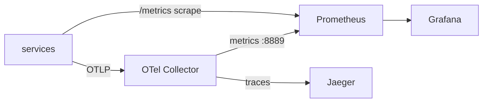

# Guide · The Observability Stack

What each backend does and what to look at. Start it with `npm run infra:up`.
Conceptual background: [Observability architecture](../architecture/06-observability.md).

---

## Prometheus — metrics · http://localhost:9090

Scrapes every service's `/metrics` and the OTel Collector's re-exported metrics
(config: [`prometheus.yml`](../../monitoring/prometheus/prometheus.yml)).

Useful queries (paste into the Prometheus expression bar):

```promql
# p95 request latency per service
histogram_quantile(0.95, sum by (service, le) (rate(http_request_duration_ms_bucket[1m])))

# error rate per service
sum by (service) (rate(http_requests_total{status=~"5.."}[1m]))
  / sum by (service) (rate(http_requests_total[1m]))

# request rate
sum by (service) (rate(http_requests_total[1m]))

# saturation signals
db_pool_utilization
cpu_usage
queue_depth
```

Check scrape health at **Status → Targets** — services show `UP` once running.

---

## Grafana — dashboards · http://localhost:3001

Anonymous viewer access is enabled (admin/admin for editing). Prometheus is the data
source (provisioned in Phase 3). Use it to build the golden-signals row: latency,
traffic, errors, saturation — the same four the anomaly-engine watches.

---

## Jaeger — traces · http://localhost:16686

Pick a service (e.g. `order-service`) → **Find Traces**. A `POST /orders` shows one
trace spanning order-service and payment-service, with child spans for the simulated
DB/Redis calls:

```
order-service POST /orders
├─ db.query (create order)
└─ HTTP POST → payment-service /charge
   ├─ redis.get (idempotency)
   └─ db.query (persist charge)
```

Inject `db_latency` on payment-service and the payment DB span visibly widens — the
trace shows *where* the time went, complementing the metric that shows *that* it
happened.

---

## OTel Collector

Receives OTLP (`:4317` gRPC, `:4318` HTTP) from services, forwards traces to Jaeger and
re-exposes metrics on `:8889` for Prometheus (config:
[`otel-collector-config.yaml`](../../monitoring/otel/otel-collector-config.yaml)).
Inspect its logs for received telemetry:
```bash
docker logs sentinel-otel --tail 50
```

---

## The mental model



- **Metric says _that_ something is wrong** (latency up, errors up) → Prometheus/Grafana.
- **Trace says _where_** (which span/service) → Jaeger.
- **Log says _why_** (the error message) → `docker logs` / `log.events`.

Together they are the evidence the incident pipeline reasons over.
