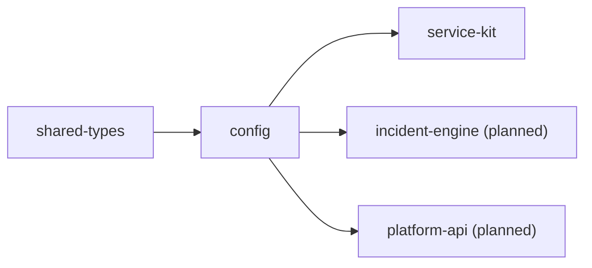

# Package · `@sentinelops/config`

Two responsibilities: **validated environment configuration** and the **configurable
severity engine**. Both are things every service needs and neither should be
reimplemented per service.

- **Location**: [`packages/config/src`](../../packages/config/src)
- **Runtime deps**: `dotenv`, `zod`, `@sentinelops/shared-types`
- **Status**: ✅ implemented · severity engine unit-tested (4/4)

---

## Part 1 — Environment (`env.ts`)

### `getEnv(): Env`
Loads `.env` (via `dotenv`), validates **all** variables against a zod schema, caches
the result, and **fails fast** with a readable message if anything is invalid:

```
Invalid environment configuration:
  - OTEL_TRACES_SAMPLER_ARG: Number must be less than or equal to 1
```

Every service calls `getEnv()` once at startup. Because the schema has sensible
defaults, the system runs out of the box with no `.env` at all (defaults point at the
local docker-compose infra).

### What it validates
Database URL, Redis URL, Kafka brokers, OTel endpoint + sampler, Prometheus URL, JWT
secret/expiry, and the LLM/embeddings settings (provider defaults to `mock`). Full key
list: [`.env.example`](../../.env.example).

### Helpers
| Function | Returns |
| --- | --- |
| `parseDatabaseUrl(url?)` | `{ host, port, user, password, database }` for libraries that need parts. |
| `kafkaBrokers(env?)` | `string[]` split from `KAFKA_BROKERS`. |

### Design choice — validate at the boundary
Config is parsed and typed **once**, at process start. The rest of the code receives a
fully-typed `Env` and never touches `process.env` directly. Invalid config can't reach
business logic.

---

## Part 2 — Severity engine (`severity.ts`)

The measurable-signal scoring model. Full design + worked example:
[Severity Model](../architecture/08-severity-model.md).

### `computeSeverity(signals, rules?) → { score, severity }`
```ts
const { score, severity } = computeSeverity({
  errorRate: 0.17,
  latencyRatio: 2800 / 180,
  affectedServices: 3,
  requestVolume: 220,
  durationSeconds: 240,
}); // → { score ≈ 0.56, severity: 'HIGH' }
```

- `signals: SeveritySignals` — the five measured inputs.
- `rules: SeverityRules` — weights, caps, thresholds; defaults to
  `DEFAULT_SEVERITY_RULES`, so callers pass it only when tuning.

### Why it lives in `config`
Severity is a policy, and policy belongs with configuration. Keeping the weights/caps/
thresholds here (not inside the incident-engine) means the [settings page](../architecture/09-security-and-rbac.md)
can tune severity without redeploying engines.

### Tests
[`severity.test.ts`](../../packages/config/src/severity.test.ts) proves: healthy⇒INFO,
demo-incident⇒HIGH/CRITICAL, monotonic in error rate, and bounded (score ≤ 1). Run with
`npm test`.

---

## How it connects



`config` sits just above `shared-types`: services and engines read env through it and
score severity through it.
