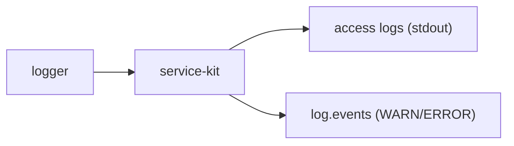

# Package · `@sentinelops/logger`

Structured JSON logging for every service, with secret redaction and request
correlation. One logger configuration means every service's logs have the same shape,
which is what lets the incident-engine and ai-investigator treat logs as machine
-readable evidence.

- **Location**: [`packages/logger/src/index.ts`](../../packages/logger/src/index.ts)
- **Runtime dep**: `pino`
- **Status**: ✅ implemented

---

## API

### `createLogger(opts): Logger`
```ts
const log = createLogger({ service: 'payment-service' });
log.info({ orderId }, 'charge succeeded');
log.error({ err: e.message }, 'charge failed');
```

| Option | Default | Meaning |
| --- | --- | --- |
| `service` | — (required) | Added to every line as `service`. |
| `level` | `process.env.LOG_LEVEL` or `info` | Minimum level. |
| `pretty` | dev + TTY | Human-readable in dev; raw JSON in prod. |

### `withRequestContext(logger, { requestId, traceId }): Logger`
Returns a child logger that stamps `requestId`/`traceId` on every line — used per
request so logs correlate with traces.

---

## Output shape

```json
{
  "level": "ERROR",
  "time": "2026-09-21T21:47:03.123Z",
  "service": "payment-service",
  "requestId": "8f3c…",
  "message": "request failed"
}
```

The line matches the log schema in [Observability](../architecture/06-observability.md)
and the `logs` table in [Database Design](../architecture/04-database-design.md), so a
log can be persisted and queried without transformation.

## Design choices

| Choice | Why |
| --- | --- |
| **pino** | Extremely fast, low-overhead JSON logging; the de-facto Node standard. |
| **ISO timestamps** (`isoTime`) | Human- and machine-sortable; matches Postgres `timestamptz`. |
| **`messageKey: 'message'`** | Aligns the message field name with the DB column and event schema. |
| **Uppercased levels** | `INFO`/`ERROR` match `LogLevel` in [shared-types](shared-types.md) and the DB `CHECK` constraint. |
| **Redaction built in** | Security is default, not opt-in (see below). |

## Secret redaction

The logger is configured to censor sensitive paths **before** serialization:
`password`, `token`, `authorization`, `apiKey`, `api_key`, and nested variants
(`*.password`, `*.token`, `headers.authorization`) become `[REDACTED]`. This satisfies
the "never expose secrets in logs" requirement from
[Security & RBAC](../architecture/09-security-and-rbac.md) at the framework level, so
no individual service has to remember to do it.

## How it connects

Used by [`service-kit`](service-kit.md) (request access logs, lifecycle logs) and,
later, directly by control-plane services. WARN/ERROR lines are also forwarded to the
`log.events` Kafka topic where they become incident evidence.


