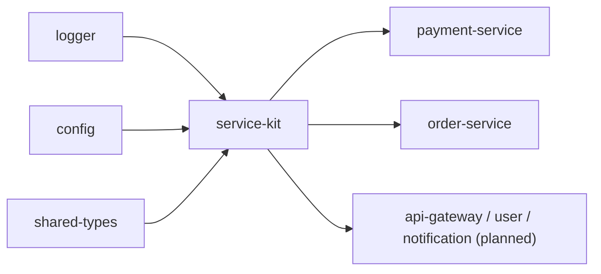

# Package · `@sentinelops/service-kit`

The **service template**. Every data-plane service is a thin layer over `service-kit`,
which provides — identically for all of them — a Fastify app, OpenTelemetry tracing,
Prometheus metrics, health/readiness/liveness endpoints, structured request logging,
and a fault controller. Build a new service in ~30 lines by calling `createService()`
and adding routes.

- **Location**: [`packages/service-kit/src`](../../packages/service-kit/src)
- **Runtime deps**: `fastify`, `prom-client`, OpenTelemetry SDK + exporters,
  `@sentinelops/{logger,config,shared-types}`
- **Status**: ✅ implemented · smoke-tested (see [Phase 2 log](../development/phase-02-microservices.md))

---

## Modules

| File | Responsibility |
| --- | --- |
| [`server.ts`](../../packages/service-kit/src/server.ts) | `createService()` — the Fastify factory that wires everything together. |
| [`metrics.ts`](../../packages/service-kit/src/metrics.ts) | `createMetrics()` — the Prometheus registry + instrument definitions. |
| [`faults.ts`](../../packages/service-kit/src/faults.ts) | `FaultController` — active-fault state + behavioural knobs + real stressors. |
| [`telemetry.ts`](../../packages/service-kit/src/telemetry.ts) | `startTelemetry()`/`stopTelemetry()` — the OTel SDK bootstrap. |

---

## `createService(opts): ServiceContext`

```ts
const svc = createService({ serviceName: 'payment-service', dbBaselineMs: 30 });
svc.app.post('/charge', async (req, reply) => { /* … */ });
await svc.start(8083);
```

Returns a `ServiceContext`:

| Member | What it is |
| --- | --- |
| `app` | the Fastify instance (register your routes on it) |
| `log` | a service-scoped [logger](logger.md) |
| `metrics` | the [metric instruments](#metrics) |
| `faults` | the [`FaultController`](#fault-controller) |
| `simulateDbQuery(baseMs?)` | fault-aware simulated DB call (records latency + pool metrics) |
| `simulateRedisOp(baseMs?)` | fault-aware simulated Redis call (throws if `break_redis`) |
| `health()` | current `ServiceHealth` |
| `start(port)` / `stop()` | lifecycle |

### Endpoints every service gets for free
| Endpoint | Purpose |
| --- | --- |
| `GET /health` | `HEALTHY`/`DEGRADED`/`UNHEALTHY` (503 when killed) |
| `GET /health/ready` | readiness probe (503 when killed) |
| `GET /health/live` | liveness probe |
| `GET /metrics` | Prometheus exposition |
| `GET /admin/faults` | list active faults |
| `POST /admin/faults` | inject a fault `{ type, params }` |
| `DELETE /admin/faults/:type` | clear one fault |
| `DELETE /admin/faults` | clear all faults |

### Automatic instrumentation on every request
An `onRequest`/`onResponse` hook pair times each request and records
`http_request_duration_ms`, `http_requests_total`, and (for 5xx)
`http_request_errors_total`, then writes a structured access log. Route, method, and
status become metric labels.

---

## Metrics

`createMetrics()` builds a `prom-client` registry with a `service` default label and
these instruments (full catalogue in
[Observability](../architecture/06-observability.md)): `http_request_duration_ms`,
`http_requests_total`, `http_request_errors_total`, `db_pool_utilization`,
`db_query_latency_ms`, `redis_latency_ms`, `queue_depth`, `cpu_usage`,
`memory_usage`, plus default process metrics. This is the **always-available** metrics
path — it works even if the OTel collector is down.

---

## Fault controller

`FaultController` is what makes failure injection **real**. It holds the set of active
faults and exposes behavioural knobs the request path and workload loop read from.

| Fault | Real effect |
| --- | --- |
| `db_latency` | `simulateDbQuery` adds `targetMs`; `db_pool_utilization` rises toward ~0.99 (derived from latency, Little's-law intuition). |
| `error_injection` | a fraction (`probability`) of requests return real 500s. |
| `kill` | service reports `UNHEALTHY`; all requests fail. |
| `cpu_stress` | a background busy-loop **actually** raises `cpu_usage`. |
| `memory_leak` | a growing buffer **actually** raises `memory_usage` (RSS). |
| `break_redis` | `simulateRedisOp` throws + spikes `redis_latency_ms`. |
| `traffic_spike` | self-generated extra internal load factor. |
| `kafka_lag` | delays producer flush; reflected as `queue_depth`. |

Faults support a `ttlMs` for auto-clear. Verified behaviour is documented in the
[Phase 2 build log](../development/phase-02-microservices.md) and the
[Failure Injection guide](../guides/03-failure-injection.md).

---

## Telemetry bootstrap

`startTelemetry(serviceName)` starts the OpenTelemetry `NodeSDK` with OTLP exporters
(traces→collector, metrics→collector) and auto-instrumentation for http/fastify/pg/
redis/kafka. Two important properties:

1. **Ordering**: it must run **before** the app imports instrumented libraries.
   Services do this by `await startTelemetry(name)` and then a **dynamic** `import()`
   of the app — see [ADR-0002](../development/decisions/adr-0002-tsx-runtime-no-build.md).
2. **Best-effort**: the whole thing is wrapped in try/catch. If OTel packages or the
   collector are unavailable, it logs a warning and the service boots anyway.

The OTel dependency versions are pinned — see
[ADR-0003](../development/decisions/adr-0003-otel-version-pinning.md) for the reason.

---

## How it connects



`service-kit` is the top of the shared-package stack and the foundation every
data-plane service stands on.
