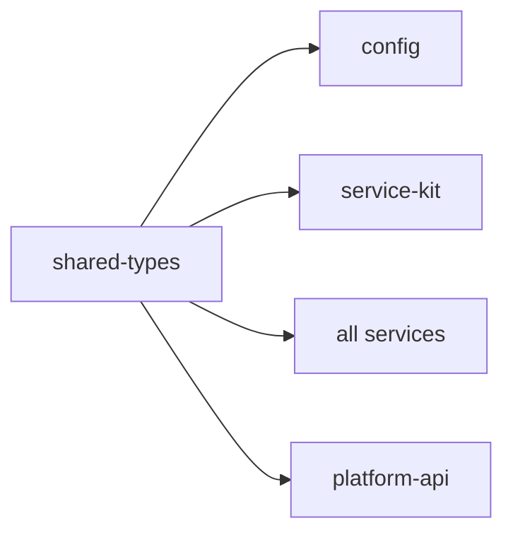

# Package · `@sentinelops/shared-types`

The **contract layer**. Every service — data plane, control plane, and the API —
imports its enums, event envelope, and domain models from here. Because the Kafka
topic names, event types, and payload schemas live in exactly one place, producers and
consumers can never silently disagree.

- **Location**: [`packages/shared-types/src`](../../packages/shared-types/src)
- **Runtime dep**: `zod` (schemas double as runtime validators)
- **Status**: ✅ implemented

---

## What's inside

| File | Exports | Purpose |
| --- | --- | --- |
| [`enums.ts`](../../packages/shared-types/src/enums.ts) | `Severity`, `IncidentStatus`, `INCIDENT_TRANSITIONS`, `EventType`, `LogLevel`, `ServiceHealth`, `Role`, `Topics`, `MetricName`, `RemediationActionType`, `RemediationRisk`, `RemediationStatus`, `FaultType` | All cross-cutting enumerations, as `const` objects + literal unions (usable at runtime **and** type level). |
| [`events.ts`](../../packages/shared-types/src/events.ts) | `EventEnvelopeSchema`/`EventEnvelope`, `MetricSampleSchema`, `LogRecordSchema`, `AnomalySchema`, `makeEnvelope()` | The Kafka message envelope + payload schemas. |
| [`domain.ts`](../../packages/shared-types/src/domain.ts) | `Service`, `ServiceDependency`, `Evidence`, `RootCauseHypothesis`, `Incident`, `IncidentEvent`, `RemediationAction` | Persistent domain models that mirror the Postgres schema. |
| [`index.ts`](../../packages/shared-types/src/index.ts) | re-exports all | Single import surface. |

---

## Design choices

### `const` objects instead of TS `enum`
```ts
export const Severity = { INFO:'INFO', LOW:'LOW', /* … */ } as const;
export type Severity = (typeof Severity)[keyof typeof Severity];
```
This gives a runtime object (for Kafka keys, DB values, iteration) **and** a precise
literal union type — without the well-known footguns of TypeScript's `enum`. It also
serializes cleanly to JSON.

### zod schemas as the single validation source
Each payload has a `…Schema` (zod) and an inferred type. Consumers validate untrusted
Kafka payloads at the boundary with the schema, then work with the inferred type
internally. One definition, both jobs.

### The state-transition map lives with the enum
`INCIDENT_TRANSITIONS` encodes the legal incident state machine next to
`IncidentStatus`, so the [incident lifecycle](../architecture/07-incident-lifecycle.md)
rules are data, not scattered `if` statements.

---

## Key exports in detail

### `Topics`
The authoritative Kafka topic names. Services import these — never string literals:
```ts
import { Topics } from '@sentinelops/shared-types';
producer.send({ topic: Topics.anomaly, /* … */ });
```

### `makeEnvelope<T>()`
Builds a well-formed `EventEnvelope` with a generated `eventId`/`timestamp`:
```ts
const evt = makeEnvelope({
  type: EventType.LATENCY_ANOMALY,
  service: 'payment-service',
  payload: anomaly,            // typed T
  traceId,                     // optional correlation
});
```

### `AnomalySchema`
The contract between the anomaly-engine (producer) and incident-engine (consumer):
`anomalyScore ∈ [0,1]`, `method ∈ {zscore, ewma, isolation_forest, threshold}`,
plus `baseline`/`deviation` so downstream reasoning can cite the numbers.

---

## How it connects



Everything depends on `shared-types`; `shared-types` depends on nothing but `zod`.
This keeps it a stable, dependency-light base of the graph.

## Consuming it

```ts
import {
  Topics, EventType, Severity, IncidentStatus,
  makeEnvelope, AnomalySchema, type Anomaly,
} from '@sentinelops/shared-types';
```
Resolved via the npm-workspace symlink; at dev time `tsx` loads the TypeScript source
directly (see [ADR-0002](../development/decisions/adr-0002-tsx-runtime-no-build.md)).
