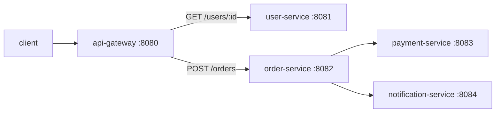

# Service · api-gateway

The single external entry point (edge tier). It routes inbound requests to the
user-service and order-service, propagating the request id and — via OpenTelemetry —
the trace context, so a request is traceable end to end across every downstream hop.

- **Port**: 8080 (`API_GATEWAY_PORT`)
- **Routes to**: `USER_SERVICE_URL`, `ORDER_SERVICE_URL`
- **Built on**: [`service-kit`](../packages/service-kit.md)
- **Code**: [`services/api-gateway/src`](../../services/api-gateway/src)
- **Status**: ✅ implemented + verified end-to-end

---

## Endpoints

Beyond the standard [service-kit endpoints](../packages/service-kit.md#endpoints-every-service-gets-for-free):

| Method | Path | Forwards to | On downstream failure |
| --- | --- | --- | --- |
| `GET` | `/users/:id` | `user-service GET /users/:id` | `503 user-service unreachable` |
| `POST` | `/orders` | `order-service POST /orders` | `503 order-service unreachable` |

The gateway relays the downstream status code and body, so a payment decline (502
from order-service) reaches the client with its real status — the gateway doesn't mask
downstream errors.

## Request propagation

Every forwarded call carries the incoming `x-request-id` (generated by service-kit if
absent). OTel auto-instrumentation adds `traceparent`, so the whole path
`gateway → order → payment/notification` is one trace in Jaeger.



## Local-dev URL note

Default downstream URLs use `127.0.0.1` (not `localhost`) because Node's `fetch`
resolves `localhost` to IPv6 `::1` while services bind IPv4 `0.0.0.0`. In Docker/K8s
the `*_SERVICE_URL` env is set to the service DNS name and this default is unused. See
the [Phase 2 build log](../development/phase-02-microservices.md#ipv6-localhost-bug).

## Run

```bash
npm run dev:gateway    # :8080 (needs user-service + order-service running)
curl localhost:8080/users/abc123
curl -XPOST localhost:8080/orders -H 'content-type: application/json' -d '{"userId":"u1"}'
```
