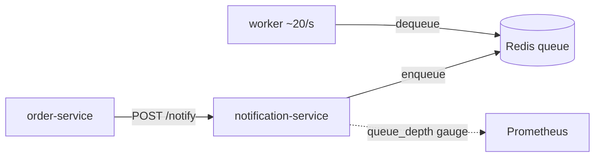

# Service · notification-service

Accepts notifications onto a Redis-backed queue and drains them with a background
worker. It **owns** the `queue_depth` gauge: the queue grows when Redis is broken or
under a traffic spike, which is the saturation signal for this service.

- **Port**: 8084 (`NOTIFICATION_SERVICE_PORT`)
- **Depends on**: Redis (simulated), baseline latency ~4ms
- **Built on**: [`service-kit`](../packages/service-kit.md)
- **Code**: [`services/notification-service/src`](../../services/notification-service/src)
- **Status**: ✅ implemented + verified

---

## Endpoints

| Method | Path | Behaviour |
| --- | --- | --- |
| `POST` | `/notify` | `simulateRedisOp()` to enqueue → `202 { status: 'queued', pending }`; `503` if Redis is broken |

A background worker dequeues ~20/sec. `queue_depth` = pending items.

## The saturation signal



- **Healthy**: enqueue ≈ dequeue, `queue_depth` stays near 0.
- **`break_redis` fault**: dequeues fail, the queue **backs up**, `queue_depth` climbs —
  a clean saturation anomaly distinct from latency/error anomalies elsewhere.
- **`traffic_spike`**: enqueue rate exceeds drain rate, depth rises.

This is why `service-kit`'s infra loop was changed to *not* reset `queue_depth` when
no `kafka_lag` fault is active — a service that owns a real queue manages the gauge
itself (see [Phase 2 log](../development/phase-02-microservices.md)).

## Note on the queue

The current queue is an in-process counter standing in for a Redis list, so
`queue_depth` behaves realistically without a live Redis dependency in dev. Real Redis
wiring (and consuming from Kafka) lands with Phase 4.

## Run

```bash
npm run dev -w @sentinelops/notification-service   # :8084
curl -XPOST localhost:8084/notify -H 'content-type: application/json' -d '{"to":"u1"}'
curl -s localhost:8084/metrics | grep queue_depth
```
