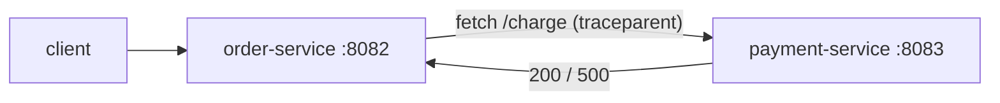

# Service · order-service

Orchestrates order creation. It writes an order, then calls **payment-service over
HTTP** — a real cross-service hop that produces a distributed trace and propagates the
failure when payment degrades. This is what lets the correlation engine see that an
order-service problem originates downstream.

- **Port**: 8082 (`ORDER_SERVICE_PORT`)
- **Calls**: payment-service at `PAYMENT_SERVICE_URL` (default `http://localhost:8083`)
- **Built on**: [`service-kit`](../packages/service-kit.md)
- **Code**: [`services/order-service/src`](../../services/order-service/src)
- **Status**: ✅ implemented

---

## Endpoints

### `POST /orders`
Body: `{ userId?: string, items?: unknown[] }`

Flow:
1. `simulateDbQuery()` — create the order row.
2. `fetch(PAYMENT_URL + '/charge')` — charge via payment-service, forwarding
   `x-request-id`; OTel auto-instrumentation adds `traceparent`, so the two services
   share one trace.
3. Map payment outcome:
   - payment `2xx` → `201 { status: 'created', orderId, payment }`
   - payment `!ok` → `502 { error: 'payment declined' }`
   - payment unreachable → `503 { error: 'payment unreachable' }`

The 502/503 mapping is deliberate: when payment-service is failing, order-service
surfaces a **distinct** error class, so the incident-engine can distinguish "order
broke because payment broke" from "order broke on its own".

---

## Files

| File | Role |
| --- | --- |
| [`src/index.ts`](../../services/order-service/src/index.ts) | Starts OTel, then dynamically imports + starts the app; graceful shutdown. |
| [`src/app.ts`](../../services/order-service/src/app.ts) | `buildOrderService()` — registers `/orders`, performs the payment call. |

---

## Why the real HTTP hop matters

A mocked payment call would produce no cross-service trace and no propagated failure.
The real `fetch` gives us:
- **One distributed trace** spanning order → payment (visible in Jaeger).
- **Realistic failure propagation**: a `db_latency` fault on payment shows up as
  elevated order-service latency and 502s — the multi-service blast radius the
  correlation engine needs to group into one incident.



## Run the chain

```bash
npm run dev:payment    # shell 1 — :8083
npm run dev:order      # shell 2 — :8082
curl -XPOST localhost:8082/orders -H 'content-type: application/json' -d '{"userId":"u1"}'
# then break payment and watch order-service return 502:
curl -XPOST localhost:8083/admin/faults -H 'content-type: application/json' \
     -d '{"type":"error_injection","params":{"probability":1}}'
curl -i -XPOST localhost:8082/orders -H 'content-type: application/json' -d '{"userId":"u1"}'
```
