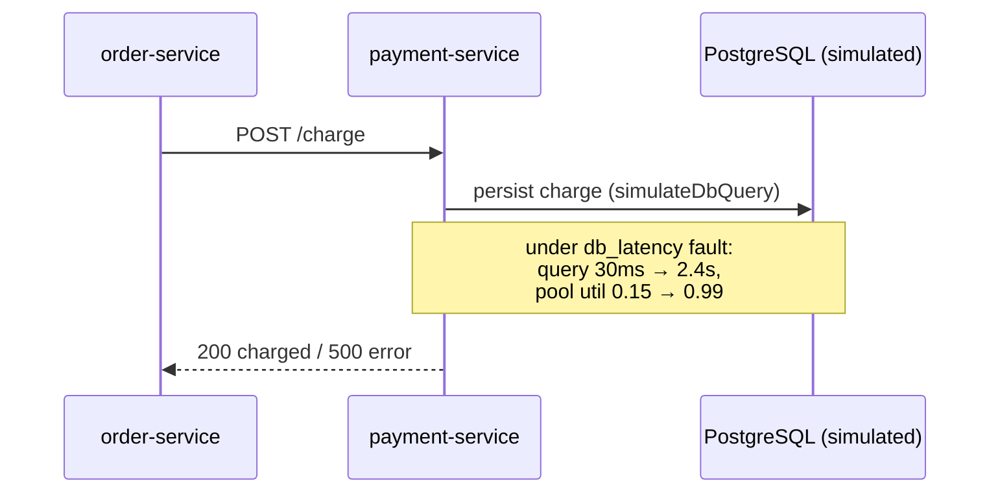

# Service · payment-service

Charges an order. It is a heavy PostgreSQL + Redis user and the **primary failure
target** in the demo — the service that gets `db_latency`, `error_injection`, and
`kill` faults applied to trigger the flagship incident scenario.

- **Port**: 8083 (`PAYMENT_SERVICE_PORT`)
- **Built on**: [`service-kit`](../packages/service-kit.md)
- **Code**: [`services/payment-service/src`](../../services/payment-service/src)
- **Status**: ✅ implemented + smoke-tested

---

## Endpoints

Beyond the standard [service-kit endpoints](../packages/service-kit.md#endpoints-every-service-gets-for-free)
(`/health`, `/metrics`, `/admin/faults`, …):

### `POST /charge`
Body: `{ orderId?: string, amount?: number }`

Flow:
1. `simulateRedisOp()` — idempotency check (tolerates `break_redis`: degrades, doesn't
   hard-fail).
2. `simulateDbQuery()` — persists the charge. This is the **hot DB path** that
   saturates under `db_latency` and drives `db_pool_utilization`.
3. If `Math.random() < faults.errorProbability()` → real **HTTP 500**.
4. Otherwise → `{ status: 'charged', paymentId, orderId, amount, dbLatencyMs }`.

Verified responses:
```
healthy:            {"status":"charged", "dbLatencyMs":21}
under db_latency:   {"status":"charged", "dbLatencyMs":2431}   (~2.4s)
under error/kill:   HTTP 500
```

---

## Files

| File | Role |
| --- | --- |
| [`src/index.ts`](../../services/payment-service/src/index.ts) | Entry point: starts OTel, then dynamically imports and starts the app; wires SIGTERM/SIGINT shutdown. |
| [`src/app.ts`](../../services/payment-service/src/app.ts) | `buildPaymentService()` — creates the service-kit context and registers `/charge`. |

The `index.ts` → dynamic-`import('./app.js')` pattern ensures OpenTelemetry patches
`http`/`fastify` **before** they load (see
[ADR-0002](../development/decisions/adr-0002-tsx-runtime-no-build.md)).

---

## Role in the demo scenario



When `db_latency` is injected, payment latency spikes and `db_pool_utilization`
approaches saturation — exactly the telemetry the anomaly-engine and severity model
consume to open a HIGH-severity incident.

## Run it

```bash
npm run dev:payment          # tsx watch, port 8083
# then, in another shell:
curl -XPOST localhost:8083/charge -H 'content-type: application/json' -d '{"amount":42}'
curl -XPOST localhost:8083/admin/faults -H 'content-type: application/json' \
     -d '{"type":"db_latency","params":{"targetMs":2400}}'
curl -s localhost:8083/metrics | grep db_pool_utilization
```

See the [Failure Injection guide](../guides/03-failure-injection.md) for the full set.
